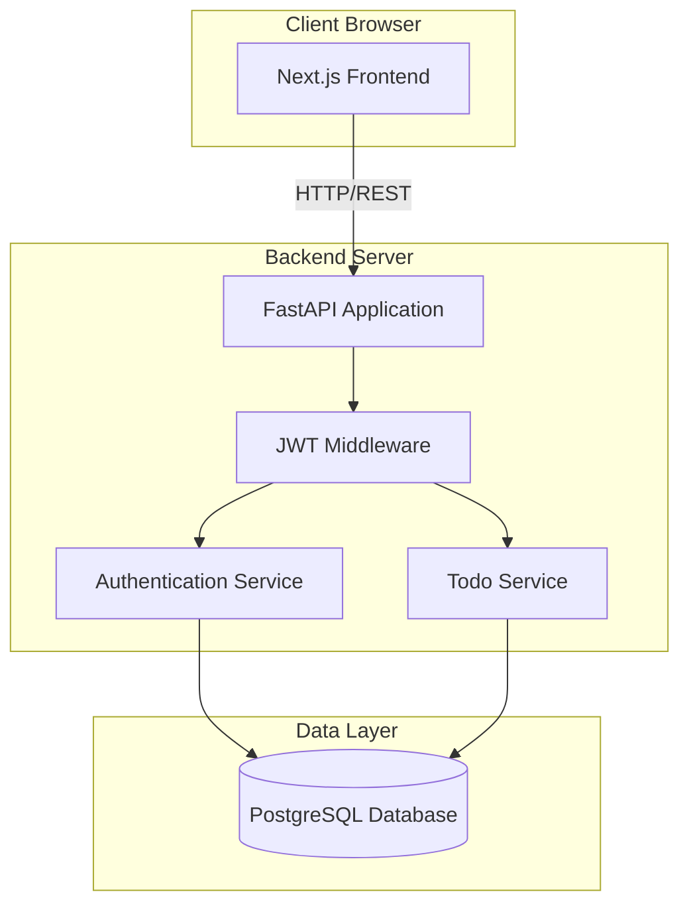
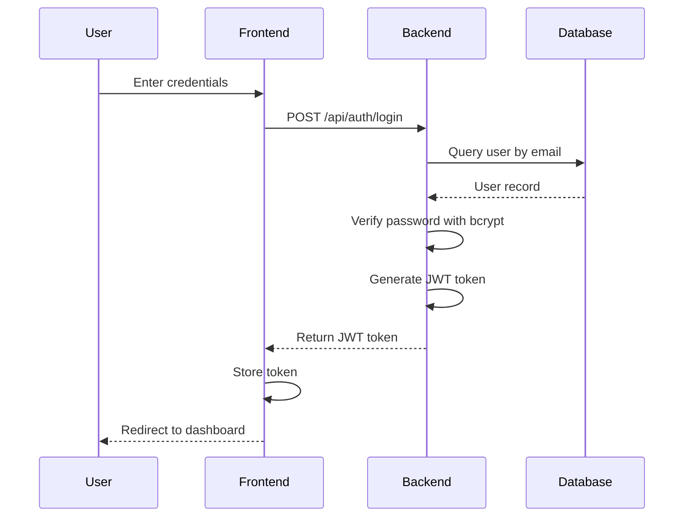
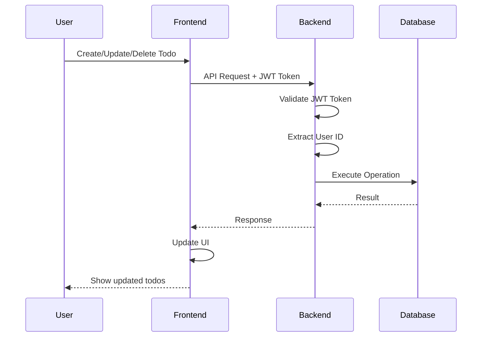
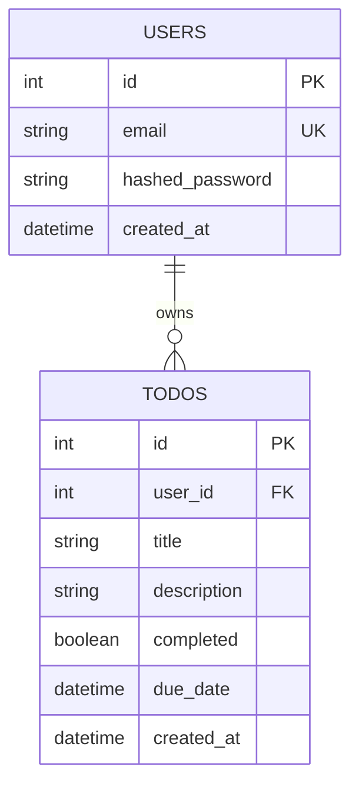

# Design Document: Full-Stack Web Application

## Overview

This design document describes the architecture and implementation approach for a full-stack todo application built with Next.js, FastAPI, and PostgreSQL. The system follows a three-tier architecture with clear separation between presentation (Frontend), business logic (Backend), and data storage (Database).

### Key Design Principles

1. **Separation of Concerns**: Frontend, backend, and database are loosely coupled through well-defined APIs
2. **Security First**: Authentication and authorization are enforced at multiple layers
3. **RESTful API Design**: Backend follows REST principles for predictable, stateless interactions
4. **Type Safety**: TypeScript on frontend and Pydantic on backend ensure type correctness
5. **Stateless Authentication**: JWT tokens enable scalable, stateless session management

### Technology Stack

- **Frontend**: Next.js 14+ (App Router), React 18+, TypeScript, Tailwind CSS
- **Backend**: FastAPI, Pydantic, SQLModel, Python 3.9+
- **Database**: PostgreSQL (Neon Serverless)
- **Authentication**: JWT with bcrypt password hashing
- **ORM**: SQLModel (combines SQLAlchemy and Pydantic)

## Architecture

### System Architecture Diagram



### Component Interaction Flow

**Authentication Flow:**


**Todo Operations Flow:**


## Components and Interfaces

### Frontend Components

#### 1. Page Components

**Landing Page (`app/page.tsx`)**
- Purpose: Entry point for unauthenticated users
- Responsibilities:
  - Display application branding and description
  - Provide navigation to login/register
  - Redirect authenticated users to dashboard
- State: None (stateless)

**Login Page (`app/(auth)/login/page.tsx`)**
- Purpose: User authentication
- Responsibilities:
  - Render login form (email, password)
  - Validate input client-side
  - Call authentication API
  - Handle errors and display messages
  - Redirect on success
- State: Form data, loading state, error messages

**Register Page (`app/(auth)/register/page.tsx`)**
- Purpose: New user registration
- Responsibilities:
  - Render registration form (email, password, confirm password)
  - Validate input client-side (email format, password strength, password match)
  - Call registration API
  - Handle errors and display messages
  - Auto-login and redirect on success
- State: Form data, loading state, error messages

**Dashboard Page (`app/dashboard/page.tsx`)**
- Purpose: Main application interface for authenticated users
- Responsibilities:
  - Fetch and display user's todos
  - Provide todo creation form
  - Render todo list with actions
  - Handle todo CRUD operations
  - Display user information
  - Provide logout functionality
- State: Todos list, loading state, error messages, form data

#### 2. UI Components

**TodoList Component**
- Props: `todos: Todo[]`, `onToggle: (id) => void`, `onDelete: (id) => void`, `onEdit: (id) => void`
- Responsibilities:
  - Render list of todos
  - Handle user interactions
  - Apply conditional styling based on completion status

**TodoItem Component**
- Props: `todo: Todo`, `onToggle: () => void`, `onDelete: () => void`, `onEdit: () => void`
- Responsibilities:
  - Display single todo with title, description, due date
  - Provide action buttons
  - Show completion status visually

**TodoForm Component**
- Props: `onSubmit: (data) => void`, `initialData?: Todo`
- Responsibilities:
  - Render form for creating/editing todos
  - Validate input
  - Handle submission

**TodoStatusToggle Component**
- Props: `completed: boolean`, `onChange: () => void`
- Responsibilities:
  - Render checkbox or toggle switch
  - Handle status changes

#### 3. Authentication Context

**AuthContext (`lib/auth.ts`)**
- Purpose: Manage authentication state across the application
- Responsibilities:
  - Store JWT token
  - Provide authentication status
  - Provide user information
  - Handle login/logout
  - Automatically redirect on auth failures
- API:
  ```typescript
  interface AuthContextType {
    user: User | null;
    token: string | null;
    login: (email: string, password: string) => Promise<void>;
    register: (email: string, password: string) => Promise<void>;
    logout: () => void;
    isAuthenticated: boolean;
    isLoading: boolean;
  }
  ```

#### 4. API Client

**API Service (`lib/api.ts`)**
- Purpose: Centralized API communication
- Responsibilities:
  - Make HTTP requests to backend
  - Attach JWT token to requests
  - Handle response parsing
  - Handle errors uniformly
  - Provide typed API methods
- API:
  ```typescript
  class ApiClient {
    // Auth endpoints
    login(email: string, password: string): Promise<LoginResponse>
    register(email: string, password: string): Promise<RegisterResponse>
    getCurrentUser(): Promise<User>
    
    // Todo endpoints
    getTodos(): Promise<Todo[]>
    createTodo(data: CreateTodoRequest): Promise<Todo>
    updateTodo(id: string, data: UpdateTodoRequest): Promise<Todo>
    deleteTodo(id: string): Promise<void>
    toggleTodoStatus(id: string): Promise<Todo>
  }
  ```

### Backend Components

#### 1. Main Application (`main.py`)

- Purpose: FastAPI application entry point
- Responsibilities:
  - Initialize FastAPI app
  - Configure CORS middleware
  - Register routers
  - Configure exception handlers
  - Provide health check endpoint
- Configuration:
  ```python
  app = FastAPI(
      title="Todo API",
      version="1.0.0",
      docs_url="/docs",
      openapi_url="/openapi.json"
  )
  
  app.add_middleware(
      CORSMiddleware,
      allow_origins=[settings.FRONTEND_URL],
      allow_credentials=True,
      allow_methods=["GET", "POST", "PUT", "PATCH", "DELETE", "OPTIONS"],
      allow_headers=["Authorization", "Content-Type"],
  )
  ```

#### 2. Authentication Router (`routers/auth.py`)

- Purpose: Handle authentication endpoints
- Endpoints:
  - `POST /api/auth/register`: Create new user account
  - `POST /api/auth/login`: Authenticate user and return JWT
  - `GET /api/auth/me`: Get current user information (protected)
- Dependencies: Database session, password hashing utilities
- Request/Response Schemas:
  ```python
  class RegisterRequest(BaseModel):
      email: EmailStr
      password: str = Field(min_length=8)
  
  class LoginRequest(BaseModel):
      email: EmailStr
      password: str
  
  class TokenResponse(BaseModel):
      access_token: str
      token_type: str = "bearer"
  
  class UserResponse(BaseModel):
      id: int
      email: str
      created_at: datetime
  ```

#### 3. Todo Router (`routers/todos.py`)

- Purpose: Handle todo CRUD operations
- Endpoints:
  - `GET /api/todos`: Get all todos for authenticated user
  - `POST /api/todos`: Create new todo
  - `PUT /api/todos/{id}`: Update existing todo
  - `DELETE /api/todos/{id}`: Delete todo
  - `PATCH /api/todos/{id}/complete`: Toggle todo completion status
- Dependencies: Database session, current user (from JWT)
- Request/Response Schemas:
  ```python
  class TodoCreate(BaseModel):
      title: str = Field(max_length=200)
      description: Optional[str] = None
      due_date: Optional[datetime] = None
  
  class TodoUpdate(BaseModel):
      title: Optional[str] = Field(None, max_length=200)
      description: Optional[str] = None
      due_date: Optional[datetime] = None
      completed: Optional[bool] = None
  
  class TodoResponse(BaseModel):
      id: int
      user_id: int
      title: str
      description: Optional[str]
      completed: bool
      due_date: Optional[datetime]
      created_at: datetime
  ```

#### 4. Authentication Service (`auth/jwt.py`)

- Purpose: JWT token generation and validation
- Responsibilities:
  - Generate JWT tokens with user ID payload
  - Validate JWT tokens
  - Extract user ID from tokens
  - Handle token expiration
- API:
  ```python
  def create_access_token(user_id: int) -> str:
      """Generate JWT token with user_id in payload"""
      
  def verify_token(token: str) -> int:
      """Validate token and return user_id"""
      
  async def get_current_user(token: str, db: Session) -> User:
      """Dependency to extract current user from JWT"""
  ```

#### 5. Password Service (`auth/password.py`)

- Purpose: Password hashing and verification
- Responsibilities:
  - Hash passwords using bcrypt
  - Verify passwords against hashes
  - Use secure comparison
- API:
  ```python
  def hash_password(password: str) -> str:
      """Hash password with bcrypt (cost factor 12)"""
      
  def verify_password(plain_password: str, hashed_password: str) -> bool:
      """Verify password against hash"""
  ```

#### 6. Database Connection (`database/connection.py`)

- Purpose: Manage database connections
- Responsibilities:
  - Create SQLModel engine
  - Provide session factory
  - Create database tables
  - Provide session dependency for routes
- API:
  ```python
  engine = create_engine(settings.DATABASE_URL)
  
  def get_session() -> Generator[Session, None, None]:
      """Dependency that provides database session"""
      
  def create_db_tables():
      """Create all database tables"""
  ```

## Data Models

### Database Schema



### SQLModel Models

**User Model (`models/user.py`)**
```python
class User(SQLModel, table=True):
    __tablename__ = "users"
    
    id: Optional[int] = Field(default=None, primary_key=True)
    email: str = Field(unique=True, index=True, sa_column_kwargs={"nullable": False})
    hashed_password: str = Field(sa_column_kwargs={"nullable": False})
    created_at: datetime = Field(default_factory=datetime.utcnow)
    
    # Relationship
    todos: List["Todo"] = Relationship(back_populates="owner", cascade_delete=True)
```

**Todo Model (`models/todo.py`)**
```python
class Todo(SQLModel, table=True):
    __tablename__ = "todos"
    
    id: Optional[int] = Field(default=None, primary_key=True)
    user_id: int = Field(foreign_key="users.id", index=True)
    title: str = Field(max_length=200, sa_column_kwargs={"nullable": False})
    description: Optional[str] = Field(default=None)
    completed: bool = Field(default=False)
    due_date: Optional[datetime] = Field(default=None)
    created_at: datetime = Field(default_factory=datetime.utcnow)
    
    # Relationship
    owner: User = Relationship(back_populates="todos")
```

### TypeScript Types

**Frontend Types (`types/index.ts`)**
```typescript
export interface User {
  id: number;
  email: string;
  created_at: string;
}

export interface Todo {
  id: number;
  user_id: number;
  title: string;
  description?: string;
  completed: boolean;
  due_date?: string;
  created_at: string;
}

export interface LoginRequest {
  email: string;
  password: string;
}

export interface RegisterRequest {
  email: string;
  password: string;
}

export interface TokenResponse {
  access_token: string;
  token_type: string;
}

export interface CreateTodoRequest {
  title: string;
  description?: string;
  due_date?: string;
}

export interface UpdateTodoRequest {
  title?: string;
  description?: string;
  due_date?: string;
  completed?: boolean;
}

export interface ApiError {
  detail: string;
}
```

